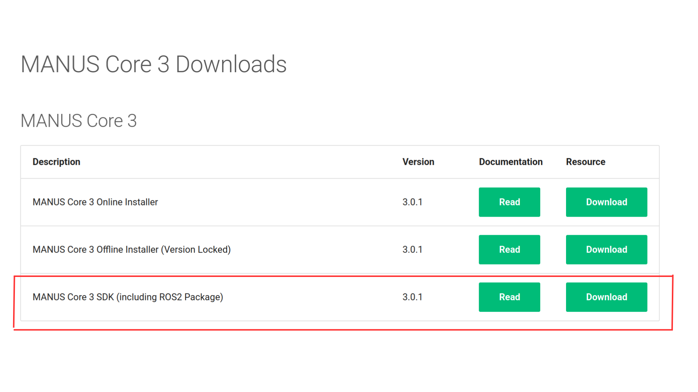

# mc_manus_plugin

This plugin gets the data of the [Manus gloves](https://www.manus-meta.com/products/quantum-metagloves) using the tools of Manus gloves for the C++ SDK of Linux you could look the documentation in the official [web site](https://docs.manus-meta.com/3.0.0/Plugins/SDK/Linux/), it get the ros topics inside of the controller easily. 


## Dependencies

* mc_rtc
* ROS2

## Prerequisites to install

#### Installing required packages with a single line sudo: Installing required packages
```bash
sudo apt-get update && sudo apt-get install -y build-essential git libtool libzmq3-dev libusb-1.0-0-dev zlib1g-dev libudev-dev gdb libncurses5-dev && sudo apt-get clean
```

#### Clone the GRPC repository and all its submodules from GitHub to your local machine using the following command: 
```bash
sudo git clone -b v1.28.1 https://github.com/grpc/grpc /var/local/git/grpc && cd /var/local/git/grpc && sudo git submodule update --init --recursive
```

#### Install the protobuf dependency by running the following command:
```bash
cd /var/local/git/grpc/third_party/protobuf && sudo ./autogen.sh && sudo ./configure --enable-shared && sudo make -j$(nproc) && sudo make -j$(nproc) check && sudo make install && sudo make clean && sudo ldconfig
```
#### Finally install GRPC by running the command below:
```bash
cd /var/local/git/grpc && sudo make -j$(nproc) && sudo make install && sudo make clean && sudo ldconfig
```

#### Core Integrated 
```bash
sudo apt-get update && sudo apt-get install -y build-essential libusb-1.0-0-dev zlib1g-dev libudev-dev gdb libncurses5-dev && sudo apt-get clean
```

#### Device rules: To allow connections to MANUS hardware you need to place the following file in the etc/udev/rules.d/ directory. This will allow the devices to be recognized and accessed by the system. After doing this, a full reboot is recommended to apply the changes. The naming of the file is relevant we recommend naming it 70-manus-hid.rules.

  ##### 70-manus-hid.rules

```bash
# HIDAPI/libusb
SUBSYSTEMS=="usb", ATTRS{idVendor}=="3325", MODE:="0666"
SUBSYSTEMS=="usb", ATTRS{idVendor}=="1915", ATTRS{idProduct}=="83fd", MODE:="0666"

# HIDAPI/hidraw
KERNEL=="hidraw*", ATTRS{idVendor}=="3325", MODE:="0666"
```

#### Install the packages of manus 

To use the Manus Core 3 you need to download the [MANUS Core 3 SDK (including ROS2 Package)](https://docs.manus-meta.com/latest/Resources/)

And you have to click in this option:


This will give you a .zip that you will have to put in your workspace.
The File that you have to focus on is, SDKClient_Linux 


#### Docker


Instead of setting up a linux machine, you can also use docker to set up your development environment. Dockerfiles for both **integrated** and **remote**. For this implementation you should use the **integrated** mode, so you could have everything in linux environment. 

#### Build integrated docker image
```bash
docker build -f ./Dockerfile.Integrated -t manus-linux-integrated .
```
Once the Docker image is built, run a container with the manus-linux-integrated image. The --net=host is not strictly necessary but helps the container communicate out of its context. The --privileged parameter is required to access the USB glove devices, so is mounting the /dev and /run/udev directories.

#### Run integrated docker container
```bash
docker run -p 5000:5000 --privileged -v /dev:/dev -v /run/udev:/run/udev -i -t manus-linux-integrated /bin/bash
```


## Install


```bash
git clone https://github.com/isri-aist/mc_manus_plugin
cd mc_manus_plugin
mkdir build && cd build
# Please edit the INSTALL_PREFIX depending on your installation
cmake .. -DCMAKE_BUILD_TYPE=RelWithDebInfo -DCMAKE_INSTALL_PREFIX=${HOME}/workspace/install #-DWITH_ROS=OFF
make
make install
```
## Compilation
For compiling the examples we have three diffrent options.

```bash
1. Make
2. Visual Studio Code
3. Visual Studio (remote cross compile)
```

## Make
A Makefile is present within the SDKMinimalCLient_Linux and SDKClient_Linux folders inside the MANUS SDK package. The example can be compiled using the following command.

```bash
make all
```

## Usage

In order to use this plugin, please consider adding the following line to your configuration file (`~/.config/mc_rtc/mc_rtc.yaml`).

Also you need to run the 

```yaml
Plugins: [ManusPlugin]
```

After following the instructions for USB or ROS, you can run your controller. A new table `ManusPlugin` should appear in `mc_rtc_panel`.

### USB

To get the manus stream for a usb manus, you must get the index of the manus. To do that, you can use the following command line:

```bash
v4l2-ctl --list-devices

# Example
# HD Pro Webcam C920:
#         /dev/video4 (4 -> index)
#         /dev/video5
#         /dev/media2
```

Once you know the index, you can add the following lines to your `mc_rtc` configuration file :

```yaml
ManusPlugin:
  - name: "manus_hand"
    index: 4
    manusBody: "tool0" # body one which to install the manus
    manusTransform: # [Optional] Panret's frame offset
      translation: [0, 0, 0]
      rotation: [0, 0, 0]
```

### ROS

To get a manus stream from a ros2 topic, you need to add the following lines to your configuration file

```yaml
ManusPlugin:
  - name: "manus_head"
    image_topic: "image_raw"
    compressed: false
    parent: "tool0"
    manusTransform:
      translation: [0, 0, 0]
      rotation: [0, 0, 0]
```

> **Please note that you can set multiple manuss (e.g. `/etc/ManusPlugin.yaml`)**

## Get the stream in my controller

In order to get the stream in your controller, you need to set a thread.
The role of this thread is to retrieve the stream from the `mc_rbdyn::ManusDevice` that has been added to the robot via the `ManusPlugin`.

**Image or heavy computations must not be in the run method of your controller**

* In the `CMakeLists.txt` :

```cmake
find_package(mc_manus REQUIRED)

# PROJECT NAME might be change to your library's name
target_link_libraries(${PROJECT_NAME} PUBLIC mc_rbdyn::mc_manus)
```

* In your controller or state :

```cpp
// std::thread display_thread; // Define in .h

display_thread = std::thread([&]{
    while(true){
      if(robot().hasDevice<mc_rbdyn::ManusDevice>("manus_head")){
        auto & cam = robot().device<mc_rbdyn::ManusDevice>("manus_head");
        const auto & img = cam.getImage();

        if(!img.empty()){
          cv::imshow("my_stream", img);
          cv::pollKey();
        }
      }
    }
  });
```

## Testing

In order to test the plugin using ros2 topic, you can install `usb_cam` ros package.

```bash
ros2 run usb_cam usb_cam_node_exe --ros-args -p pixel_format:="mjpeg2rgb"
```

Then using the configuration given in the ROS section, you can get your manus stream in your controller or state.


## Debugging

To visualize the stream, please edit the checkbox status from the tab `ManusPlugin` in `mc_rtc_panel` (rviz).

```bash
ros2 launch mc_rtc_ticker display.launch
```
